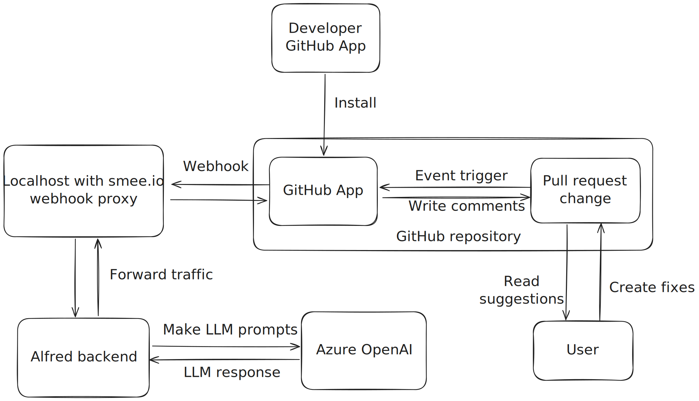

# Alfred

Alfred is a GitHub application designed to help developers improve their pull requests by providing feedback and suggestions.

## Overview



## Installation

### SaaS Installation

TBD

### Local Run

#### Create your own Alfred GitHub App

1. Start a new webhook channel on [smee.io](https://smee.io/) and save the Webhook Proxy URL for later use.
2. Log in to GitHub.
3. Register a `new GitHub App` under your profile based on the [GitHub Docs about creating apps](https://docs.github.com/en/apps/creating-github-apps/registering-a-github-app/registering-a-github-app#registering-a-github-app)
   - Paste `Webhook Proxy URL` to the Webhook URL field
   - Create your own `webhook secret`
   - Generate a `private key` and download it
   - Save the `GitHub App ID` for later use
4. Go to `Permissions & events` and set the followings up
   - Under `Repository permissions`:
     - Checks read and write access
     - Contents read access
     - Pull requests read and write access
   - Under `Subscribe to events`:
     - Pull request
     - Pull request review
     - Pull request review comment
     - Pull request review thread

#### Install your own Alfred GitHub App to a repository

1. Go to `Developer settings` under your GitHub profile settings
2. Click to your GitHub App name
3. Select `Install App` sidemenu option
4. Choose an account and click to `Install` button
5. Select your desired repository and click `Install`

#### Setup alfred local instance

1. Copy the .env.example file to .env and fill up with the followings:
   - GITHUB_APP_ID
   - one of:
       - `GITHUB_APP_PRIVATE_KEY`
       - `GITHUB_APP_PRIVATE_KEY_FILE` - this should point to a local file with the private key
   - `GITHUB_WEBHOOK_SECRET`
   - `GCP_SERVICE_ACCOUNT` - this should point to a local file with the GCP service account where the model is hosted
   - `AZURE_OPENAI_ENDPOINT`
   - `AZURE_OPENAI_DEPLOYMENT`
   - `AZURE_OPENAI_API_KEY`
   - `AZURE_OPENAI_API_VERSION`
   - set `ENVIRONMENT` to `"local"`

##### Automatic way to install python environment with dependecies

Run `make setup` in this project folder

##### Manual way to install with dependecies

1. Install [pyenv](https://github.com/pyenv/pyenv?tab=readme-ov-file#installation) and install Python 3.12.6
   ```bash
   brew update && brew install pyenv &&
   pyenv install 3.12.6
   ```
2. Create venv and activate
   ```bash
   ~/.pyenv/versions/3.12.6/bin/python3 -m venv .venv &&
   source .venv/bin/activate
   ```
3. Install [poetry](https://python-poetry.org/docs/#installing-manually) and install project dependecies
   ```bash
   pip install -U pip setuptools;
   pip install poetry &&
   poetry install
   ```
4. Install smee-client:
   ```bash
   npm install --global smee-client
   ```
5. Install Terraform
   ```bash
   brew tap hashicorp/tap
   brew install hashicorp/tap/terraform
   ```
6. Install TFlint
   ```bash
   brew install tflint
   ```

#### Run alfred locally

1. Start the smee webhook:
   ```bash
   npx smee -u https://smee.io/{YOUR_WEBHOOK_PATH} -t http://localhost:5500/api/webhook
    ```
2.	Activate virtual environment and start alfred:
   ```bash
   source .venv/bin/activate &&
   python3 main_local.py
   ```
3. Create an event on your PR (like new commit)

#### Setup alfred local instance using Lambda

Alfred is deployed as a Lambda function so optionally you can also run this locally instead of the above mentioned webserver in `main_local.py`. For this, you need the AWS SAM CLI installed.

1. Make sure that `.env` file exists and is filled with the necessary environment variables.

2. Login to the `outshift-common-dev` AWS account using duo-sso.

3. Start the Smee client for the Lambda:
   ```bash
   make smee_id=your-smee-id start-smee-for-lambda
   ```

4. Build and start the Lambda using sam:
   ```bash
   make start-lambda
   ```