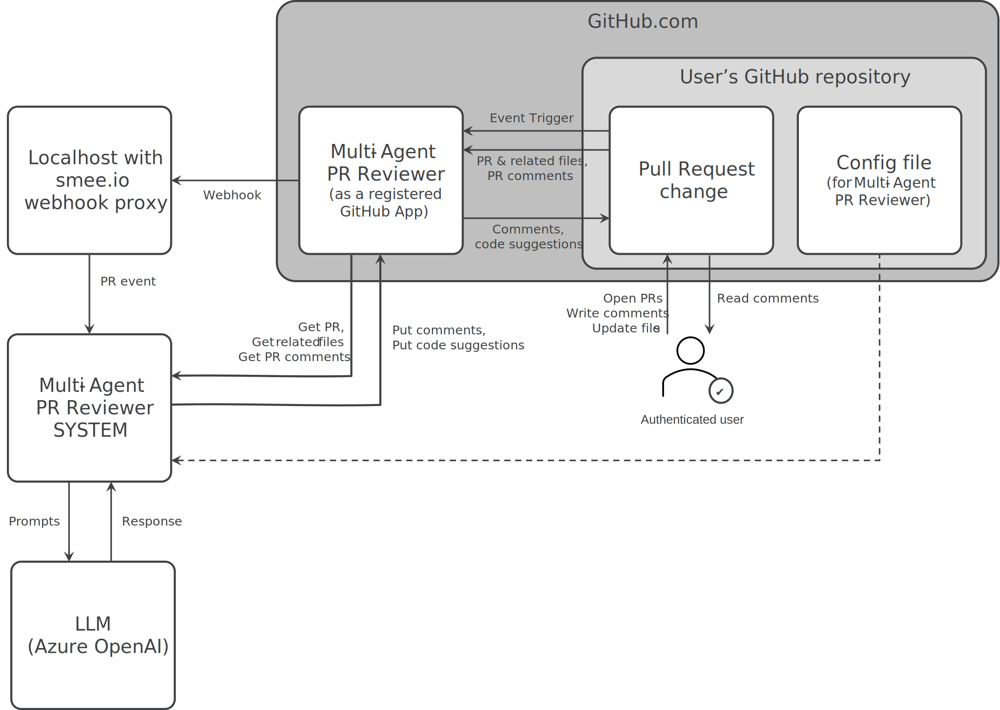
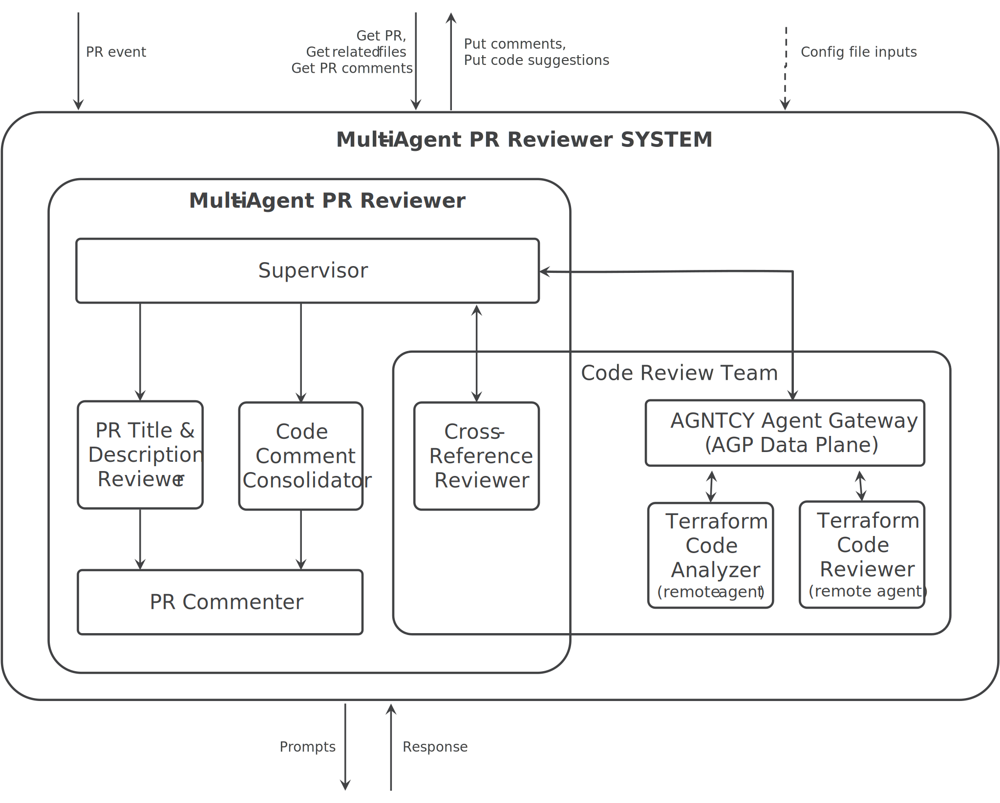

## Multi-Agent Pull Request Reviewer
[](CHANGELOG.md)
[](CODE_OF_CONDUCT.md)

*A GitHub app that provides feedback on pull requests.*

This project is an example multi-agent application designed to help developers improve their Terraform code pull requests by providing feedback and suggestions. It automates parts of the PR review process, making it easier to identify potential issues, improve code quality, and adhere to best practices.

The Multi-Agent PR Reviewer demonstrates the use of the **[AGNTCY](https://github.com/agntcy) [Agent Gateway Protocol (AGP)](https://github.com/agntcy/agp)** and **[AGP server](https://github.com/agntcy/agp/tree/main/data-plane)** for seamless interaction with remote agents. The core app, along with its remote agents, is built using LangGraph, showcasing a modular and extensible approach to multi-agent workflows.

It was originally conceived to focus on the specific needs of IaC. It is ready for use as-is or can be customized for experimentation. You can add new embedded or remote agents, modify the existing agent workflow, or tailor agent prompts to suit your specific PR review use cases.

---

### Overview





The Multi-Agent PR Reviewer provides GitHub integration and a set of agents capable of performing basic Terraform pull request (PR) reviews. The current agent workflow focuses on the following tasks:

- **Agent 0: Supervisor**
  Coordinates the execution of the other agents, especially the code review agent team.

- **Agent 1: PR Title and Description Review**  
  Ensures that the PR's title and description are clear, complete, and provide enough context for reviewers.  

- **Agent 2: Terraform Code Analyzer (remote)**
 Runs Terraform linters on your code.
  (LINK TO REPO)

- **Agent 3: Terraform Code Review (remote)**  
  Examines Terraform code for common issues, such as syntax errors, security flaws, and poor structural design.  
  (LINK TO REPO)

- **Agent 4: Cross-reference Reviewer**
  Checks cross-references to ensure validity and resolve conflicts.

- **Agent 5: Code Comment Consolidator**  
  Once the code review team is done, removes any overlapping comments.

- **Agent 6: PR Commenter**
  Constructs comments from other agent inputs to write to the Pull Request.

---

### **How It Works**

1. **GitHub Integration**  
   The Multi-Agent PR Reviewer is installed as a GitHub app. When a pull request is created or updated, the app automatically triggers the agent workflow to review the changes.

2. **Agent Workflow**  
   The workflow is managed by the supervisor, and begins with the PR Title and Description Review Agent, followed by the Code Review team. The supervisor collects feedback the code review team and sends it on to the code comment consolidator before sending to the PR commenter. The PR commenter comments directly on the GitHub PR, providing actionable insights for the developer.

3. **Agent Communication to remote agents**  
   The project uses the AGNTCY Agent Gateway Protocol (AGP) to facilitate communication between the core application and remote agents. Remote agents can be run on separate servers, allowing for distributed and scalable execution.

---

### **Customization and Experimentation**

This project is designed to be a starting point for developers who want to experiment with multi-agent workflows, remote agents, or build their own PR reviewer bots. Here’s how you can customize it:

1. **Add New Agents**  
   Create new embedded or remote agents to perform additional tasks, such as:
   - Reviewing documentation for completeness.
   - Assessing Terraform modularity and best practices.
   - Summarizing Terraform plans or results from security scans.

2. **Modify Existing Agents**  
   Customize the logic or prompts of the existing agents to better suit your specific needs. For example:
   - Update the PR Title and Description Review Agent to enforce your specific requirements.
   - Modify the checks done by the Code Review Agent.

3. **Modify the Agent Workflow**  
   Adjust the sequence of agents or introduce conditional logic to the workflow. For example:
   - Run specific agents only when certain files are modified.
   - Chain new agents into the existing workflow.

4. **Points of Interest in the Code**  
   - **Agent Workflow Definition**: [Insert file and line number]  
   - **Agent Prompts**: [Insert file and line number]  
   - **Agent Communication Setup**: [Insert file and line number]  
   - **Adding New Agents**: [Insert file and line number]

---

### **Getting Started**

To get started, go [TUTORIAL.md](./TUTORIAL.md)


Everything below is potential dupe

1. Check dependencies

   - [Github](https://github.com/)

   - [Docker](https://docs.docker.com/get-started/get-docker/)

   - [Docker Compose](https://docs.docker.com/compose/)

   - [Running Azure OpenAI Instance and API Key](https://learn.microsoft.com/en-us/azure/cognitive-services/openai/quickstart)

2. Clone the repository:  
   ```bash
   git clone https://github.com/<your-repo-name>.git
   cd multi-agent-pr-reviewer
   ```

3. Set up the GitHub app:  
   Follow the instructions in the [GitHub App Setup Guide](link-to-guide) to install the Multi-Agent PR Reviewer on your repository.

4. Run the application:  
   ```bash
   <insert command to run the app>
   ```

5. Start experimenting:  
   Modify the codebase, create new agents, or adjust the prompts to explore the power of AGNTCY in multi-agent workflows.


---
## Roadmap

See the [open issues](https://github.com/cisco-ai-agents/tf-pr-review-agntcy-multi-agent/issues) for a list
of proposed features (and known issues).

---
## Contributing

Contributions are what make the open source community such an amazing place to
learn, inspire, and create. Any contributions you make are **greatly
appreciated**. For detailed contributing guidelines, please see
[CONTRIBUTING.md](CONTRIBUTING.md)

---
## License

Distributed under the Apache-2.0 License. See [LICENSE](LICENSE) for more
information.

---
## Contact

[cisco-outshift-ai-agents@cisco.com](mailto:cisco-outshift-ai-agents@cisco.com)

Project Link:
[https://github.com/cisco-ai-agents/tf-pr-review-agntcy-multi-agent](https://github.com/cisco-ai-agents/tf-pr-review-agntcy-multi-agent)

---
## Acknowledgements

- [Langgraph](https://github.com/langchain-ai/langgraph) for the agentic platform.

For more information about our various agents, please visit the [agntcy project page](https://github.com/agntcy).


[./docs/resources/SystemDrilldown.svg]: .docs/resources/SystemDrilldown.svg