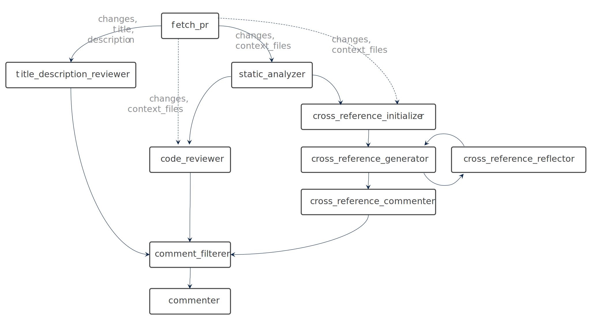

# Multi-Agent Pull Request Reviewer

*A GitHub app that provides feedback on Terraform pull requests.*

This project is an example multi-agent application designed to help developers improve their Terraform code pull requests by providing feedback and suggestions. It automates parts of the PR review process, making it easier to identify potential issues, improve code quality, and adhere to best practices.

## Overview
The Multi-Agent PR Reviewer demonstrates the use of the **[AGNTCY](https://github.com/agntcy) [Agent Connect Protocol (ACP)](https://gtihub.com/agntcy/acp-spec), [Agent Gateway Protocol (AGP)](https://github.com/agntcy/agp)** and **[AGP server](https://github.com/agntcy/agp/tree/main/data-plane)** for seamless interaction with remote agents. The core app, along with its remote agents, is built using LangGraph, showcasing a modular and extensible approach to multi-agent workflows.

It was originally conceived to focus on the specific needs of IaC. It is ready for use as-is or can be customized for experimentation. You can add new embedded or remote agents, modify the existing agent workflow, or tailor agent prompts to suit your specific PR review use cases.

This project is part of the [AGNTCY](https://docs.agntcy.org/pages/introduction.html) initiative — an open source collective building the infrastructure for the Internet of Agents (IoA): a secure, interoperable layer for agent-to-agent collaboration across organizations and platforms.

### Features

- Connects to your GitHub repository via a GitHub App.
- Demonstrates use of remote agents over AGNTCY Agent Connect Protocol (ACP) or via an AGNTCY Agent Gateway over AGNTCY Agent Gateway Protocol (AGP).
- Reviews and provides suggestions on the PR title and description.
- Performs linting and static analysis using the Terraform Code Analyzer Agent as a local agent or as a remote agent via ACP or AGP.
- Conducts a thorough code review using the Terraform Code Reviewer Agent as a local agent or as a remote agent via ACP or AGP.
- Aggregates and de-duplicates feedback to avoid redundant comments across multiple triggers.
- Posts both PR-level and inline comments with feedback on Terraform code.
- Activated on demand by commenting "Alfred review" on a pull request.

## Details
The Multi-Agent PR Reviewer provides GitHub integration and a set of agents capable of performing basic Terraform pull request (PR) reviews. The current agent workflow focuses on the following tasks:

- **Agent 0: Supervisor**
  Coordinates the execution of the other agents.

- **Agent 1: PR Title and Description Review**  
  Ensures that the PR's title and description are clear, complete, and provide enough context for reviewers.  

- **Agent 2: Terraform Code Analyzer (option: remote)**   
  Runs Terraform linters on your code.   
  [https://github.com/cisco-outshift-ai-agents/tf-code-analyzer-agntcy-agent](https://github.com/cisco-outshift-ai-agents/tf-code-analyzer-agntcy-agent)

- **Agent 3: Terraform Code Review (option: remote)**  
  Examines Terraform code for common issues, such as syntax errors, security flaws, and poor structural design.     
  [https://github.com/cisco-outshift-ai-agents/tf-code-reviewer-agntcy-agen](https://github.com/cisco-outshift-ai-agents/tf-code-reviewer-agntcy-agent)

- **Agent 4a: Cross-reference Reviewer**   
  Checks cross-references to ensure validity and resolve conflicts.

- **Agent 4b: Cross-reference Reflector**  
  Evaluates the output of Cross-reference Reviewer agent.

- **Agent 4c: Cross-reference Commenter**
  Constructs the cross-reference comments.

- **Agent 5: Comment Filterer**  
  Assesses comments and removes any overlap before comments are posted.

- **Agent 6: Review Assistant**   
  Responds to a user reply made to PR Reviewer code comments.

## How It Works

1. **GitHub Integration**  
   The Multi-Agent PR Reviewer is installed as a GitHub app. When a pull request is created or updated, the app automatically triggers the agent workflow to fetch the PR details and then review the changes.

2. **Agent Workflow**  
The workflow begins with fetching PR details (fetch_pr).
Static analysis (static_analyzer) and code review (code_reviewer) are performed in parallel with title/description review (title_description_reviewer).
Cross-referencing (cross_reference_initializer, generator, reflector) iteratively processes the PR content and static analysis results.
All comments are filtered (comment_filterer) before being finalized and posted to the PR (commenter).

4. **Agent Communication to remote agents**  
   This project demonstrates the use of **ACP (Agent Connect Protocol)** or **AGP (Agent Gateway Protocol)** for remote agent communication. These protocols come from the [AGNTCY](https://docs.agntcy.org/pages/introduction.html) ecosystem and enable the core app to interact with distributed agents in a secure and scalable way.

   The user decides which mode they want to run by setting an environment variable. Docker files in this repository take care of installation of all required files. Only one mode at a time is supported.

   This project's use of ACP vs AGP is described in [TUTORIAL.md](./TUTORIAL.md) in more detail.

## Customization and Experimentation

This project is designed to be a starting point for developers who want to experiment with multi-agent workflows, remote agents, or building their own PR reviewer agents. Here’s how you can customize it:

1. **Add New Agents**  
   Create new embedded or remote agents to perform additional tasks, such as:
   - Reviewing documentation for completeness.
   - Assessing Terraform modularity and best practices.
   - Summarizing Terraform plans or results from security scans.

2. **Modify Existing Agents**  
   Customize the logic or prompts of the existing agents to better suit your specific needs. For example:
   - Update the PR Title and Description Review Agent to enforce your specific requirements.
   - Modify the checks done by the Code Review Agent.

3. **Modify the Agent Workflow**  
   Adjust the sequence of agents or introduce conditional logic to the workflow. For example:
   - Run specific agents only when certain files are modified.
   - Chain new agents into the existing workflow.

## Installation

To get started, see [TUTORIAL.md](./TUTORIAL.md)

## Evaluation

For detailed instructions on how to evaluate AI Agent, please refer to the [Evaluation Guide](eval/README.md).

## Roadmap

See the [open issues](https://github.com/cisco-ai-agents/tf-pr-review-agntcy-multi-agent/issues) for a list
of proposed features (and known issues).

## Contributing

Contributions are what make the open source community such an amazing place to
learn, inspire, and create. Any contributions you make are **greatly
appreciated**. For detailed contributing guidelines, please see
[CONTRIBUTING.md](CONTRIBUTING.md)

## License

Distributed under the Apache-2.0 License. See [LICENSE](LICENSE) for more
information.

## Contact

[cisco-outshift-ai-agents@cisco.com](mailto:cisco-outshift-ai-agents@cisco.com)

Project Link:
[https://github.com/cisco-outshift-ai-agents/pr-review-agntcy-multi-agent](https://github.com/cisco-outshift-ai-agents/pr-review-agntcy-multi-agent)

## Acknowledgements

- [Langgraph](https://github.com/langchain-ai/langgraph) for the agentic platform.
- The [AGNTCY](https://github.com/agntcy) project.
