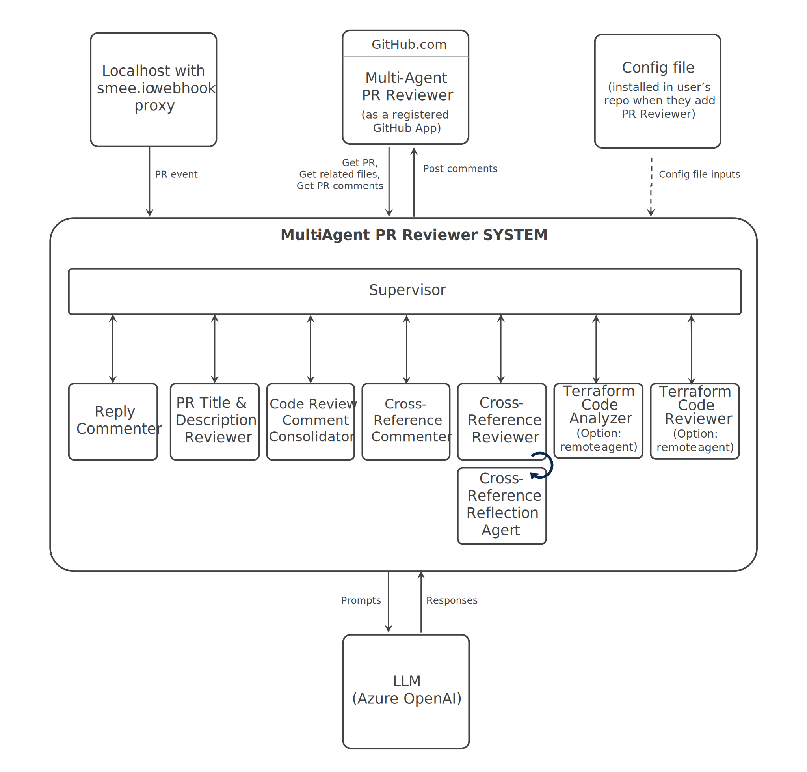

# Getting Started with the Multi Agent PR Reviewer



## Prerequisites

Ensure you have the following installed:

### Tools & Dependencies
- [Github](https://github.com/)
- [Git](https://git-scm.com/)
- [Docker](https://docs.docker.com/get-started/get-docker/)
- [Docker Compose](https://docs.docker.com/compose/)
- [Running Azure OpenAI Instance and API Key](https://learn.microsoft.com/en-us/azure/cognitive-services/openai/quickstart)

### Other Components
These components all need to be installed, following the instructions described in the individual repositories:
- [AGNTCY Agent Gateway](https://github.com/agntcy/agp)
- [Terraform Code Analyzer agent](https://github.com/cisco-outshift-ai-agents/tf-code-analyzer-agntcy-agent)
- [Terraform Code Reviewer agent](https://github.com/cisco-outshift-ai-agents/tf-code-reviewer-agntcy-agent)
  

## Setup Instructions

#### 1. Clone the The Multi Agent PR Reviewer Repository

```bash
git clone https://github.com/cisco-outshift-ai-agents/pr-review-agntcy-multi-agent

cd pr-review-agntcy-multi-agent

```

#### 2. Create a smee.io wehook

Head to https://smee.io/ and start a new channel

#### 3. Create a Github App

1. **Log into [Github](https://github.com/)**

2. **Register a new [Github App](https://docs.github.com/en/apps/creating-github-apps/registering-a-github-app/registering-a-github-app#registering-a-github-app)**

- Under the **Webhook** section

- Ensure the webhook is set to Active

- Specify your smee.io webhook URL

- Set your webhook secret to our value of choice (make sure to note it down)

- Set the following Repository permissions:

- Checks [read & write]

- Contents [read & write]

- Issues [read & write]

- Pull Requests [read & write]

- Under Subscribe to Events, enable:

- Issue comment

- Pull request

- Pull request review comment

**3. Download your Github App's Private Key**

- Go to `Developer settings` under your Github profile settings

- Click on your Github App Name

- Select the `General` side menu option

- Scroll down to `Private keys` and click `Generate a private key`to download

- Move this file to your local clone of the Multi Agent Terraform PR Reviewer Service

**4. Note your Github App ID**
- Select the `General` side menu option

- In the `About` section, you'll see the App ID

**5. Install the Github App to your repository**

- Select the `Install App` side menu option on your Github App settings page

- Choose an account and click the `Install` option

- Select your desired Terraform repository and click `Install`

#### 4. Specify Environment Variables
Copy the example .env file and provide relevant values
`cp .env.example .env`

Fill in with:
```
GITHUB_APP_ID="<your_github_app_id>"
GITHUB_APP_PRIVATE_KEY_FILE=<path_to_your_private_key_file>
GITHUB_WEBHOOK_SECRET="<your_github_webhook_secret>"

AZURE_OPENAI_ENDPOINT="<your_azure_openai_endpoint>"
AZURE_OPENAI_DEPLOYMENT="<your_azure_openai_deployment>"
AZURE_OPENAI_API_KEY="<your_azure_openai_api_key>"
AZURE_OPENAI_API_VERSION="<your_azure_openai_api_version>"

SMEE_URL="<your_smee_url>"
```

#### 5. Run the Multi Agent Terraform PR Reviewer Service, AGP Gateway, and Remote Agents

Spin up the services using Docker Compose:

`docker compose --env-file .env -f docker/docker-compose.yaml up --build`

#### 6. Trigger PR Review

1. Create a pull request in your connected Terraform repository

2. Comment `Alfred review` on the PR

3. Watch your docker compose window to observe the webhook, the multi agent terraform pr review service, and the remote agents in action.

The agent will review the code and post suggestions as comments directly on your PR.
