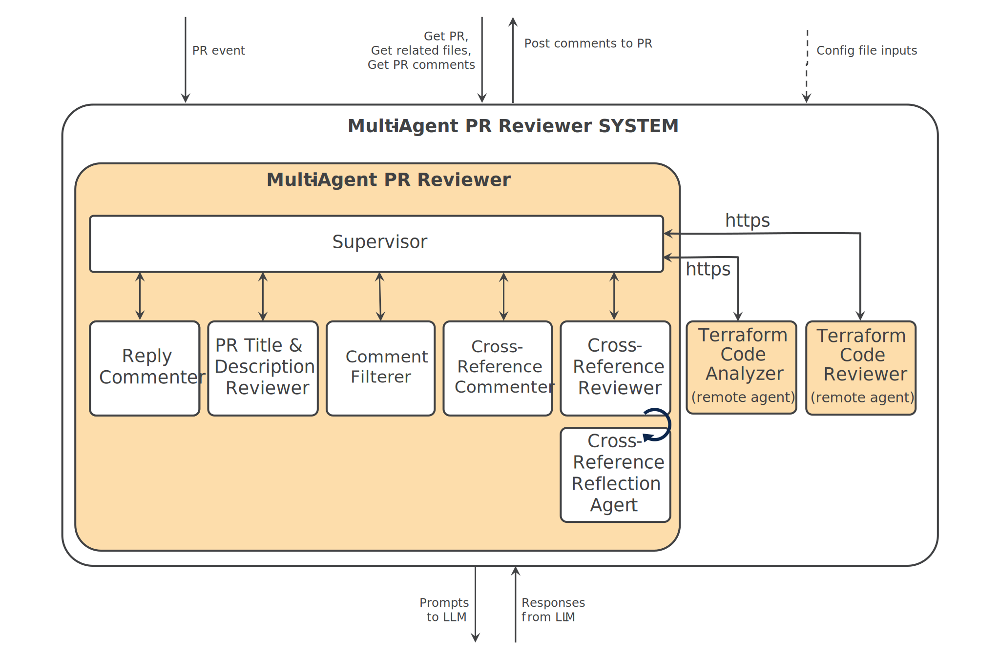

# Getting Started with the Multi Agent PR Reviewer


## Prerequisites

Ensure you have the following installed:

**Tools & Dependencies**
- [Github](https://github.com/)
- [Git](https://git-scm.com/)
- [Docker](https://docs.docker.com/get-started/get-docker/)
- [Running Azure OpenAI Instance and API Key](https://learn.microsoft.com/en-us/azure/cognitive-services/openai/quickstart)

**Other Components**
- [AGNTCY Agent Gateway](https://github.com/agntcy/agp)
- [Terraform Code Analyzer agent](https://github.com/cisco-outshift-ai-agents/tf-code-analyzer-agntcy-agent)
- [Terraform Code Reviewer agent](https://github.com/cisco-outshift-ai-agents/tf-code-reviewer-agntcy-agent)
  

## Setup Instructions

### 1. Clone the Multi Agent PR Reviewer repository

```bash
git clone https://github.com/cisco-outshift-ai-agents/pr-review-agntcy-multi-agent

cd pr-review-agntcy-multi-agent

```

### 2. Setup up Multi Agent PR Reviewer as a GitHub app

#### A. Create a smee.io wehook

Head to https://smee.io/ and start a new channel

#### B. Create a Github App

  i. **Log into [Github](https://github.com/)**

  ii. **Register a new [Github App](https://docs.github.com/en/apps/creating-github-apps/registering-a-github-app/registering-a-github-app#registering-a-github-app)**

  - Under the **Webhook** section
    - Ensure the webhook is set to Active
    - Specify your smee.io webhook URL
    - Set your webhook secret to our value of choice (make sure to note it down)
    - Set the following Repository permissions:
      - Checks [read & write]
      - Contents [read]
      - Issues [read & write]
      - Pull Requests [read & write]

  - Under **Subscribe to Events**, enable:
    - Issue comment
    - Pull request
    - Pull request review comment

  iii. **Download your Github App's Private Key**
  - Go to `Developer settings` under your Github profile settings
  - Click on your Github App Name
  - Select the `General` side menu option
  - Scroll down to `Private keys` and click `Generate a private key`to download
  - Move this file to your local clone of the Multi Agent Terraform PR Reviewer Service

  iv. **Note your Github App ID**
  - Select the `General` side menu option
  - In the `About` section, you'll see the App ID

  v. **Install the Github App to your repository**
  - Select the `Install App` side menu option on your Github App settings page
  - Choose an account and click the `Install` option
  - Select your desired Terraform repository and click `Install`

### 3. Configure Multi-agent PR Reviewer

#### A. Set Environment Variables: your GitHub App and OpenAI credentials
Copy the example .env file and provide relevant values
`cp .env.example .env`

Fill in with:
```
GITHUB_APP_ID="<your_github_app_id>"
GITHUB_APP_PRIVATE_KEY_FILE=<path_to_your_private_key_file>
GITHUB_WEBHOOK_SECRET="<your_github_webhook_secret>"

AZURE_OPENAI_ENDPOINT="<your_azure_openai_endpoint>"
AZURE_OPENAI_DEPLOYMENT="<your_azure_openai_deployment>"
AZURE_OPENAI_API_KEY="<your_azure_openai_api_key>"
AZURE_OPENAI_API_VERSION="<your_azure_openai_api_version>"

SMEE_URL="<your_smee_url>"
```
#### B. Set environment variables: configure (Remote) Agents as local, over ACP, or via AGP

There are two agents that you can opt to run remotely over Agent Connect Protocol (ACP) or Agent Gateway Protocol (AGP):
   * **Code Analyzer agent** [`tf-code-analyzer-agntcy-agent`](https://github.com/cisco-outshift-ai-agents/tf-code-analyzer-agntcy-agent)
   * **Code Reviewer agent**[`tf-code-reviewer-agntcy-agent`](https://github.com/cisco-outshift-ai-agents/tf-code-reviewer-agntcy-agent)

The diagram below shows agent flows for when these two agents are configure to run remotely using ACP mode  *(NOTE: Alternative diagrams for other modes can be found in the ./docs/resources/ folder)*:


**[ACP](https://docs.agntcy.org/pages/syntactic_sdk/connect.html)** provides a standardized **HTTP-based API interface** for invoking remote agents. In this project, ACP can be used to make **stateless run requests** to the code analyzer and code reviewer agents. These agents expose ACP-compatible endpoints, allowing the PR reviewer to trigger the Code Analyzer and Code Reviewer agents over https.

**[AGP](https://docs.agntcy.org/pages/messaging_sdk/agp-index.html)** enables **real-time messaging** between agents via a local AGP gateway. Both remote agents are also accessible using AGP for session-based or streaming workflows. In this project, AGP can be used to connect to the [Code Analyzer](https://github.com/cisco-outshift-ai-agents/tf-code-analyzer-agntcy-agent/blob/a7b555d07ba87419928f3d60b45d9e4467fdfde7/app/main.py#L184) and [Code Reviewer](https://github.com/cisco-outshift-ai-agents/tf-code-reviewer-agntcy-agent/blob/645d13b9e716b2f34828ce8c9dc8fdf8ac729a70/app/main.py#L278) agents.  Messages are sent via a gateway container, and responses are received asynchronously for rich, structured output (e.g., review comments, analysis results). Here is the [link](https://docs.agntcy.org/pages/messaging_sdk/agp-howto.html) to the AGP "Getting Started Guide" for more information.


i. **Set Environment Variables for Agent Mode Configuration**  

To control which protocol the PR reviewer uses for remote agent interaction, set the following environment variable:

      ```bash
      export AGENT_MODE=acp
      ```

Accepted values:
* `local` – use embedded agents (default)
* `acp` – use **HTTP-based ACP**
* `agp` – use **real-time AGP messaging**


ii. **Additional configuration required for ACP mode**  

To use **ACP** mode, you must ensure the following variables are also exported in your environment (or defined in the `.env` file):

    ```bash
    export ACP_TF_CODE_ANALYZER_HOST=http://127.0.0.1:8133/api/v1
    export ACP_TF_CODE_REVIEWER_HOST=http://127.0.0.1:8123/api/v1
    ```

When you get to the next step and start up the service plus remote agents, make sure the **Code Analyzer Agent** and **Code Reviewer Agent** are running locally on the specified ports, or adjust these URLs accordingly.


#### 4. Run the Multi Agent PR Reviewer Service, AGP Gateway, and Remote Agents

Spin up the services using Docker Compose:

`docker compose --env-file .env -f docker/docker-compose.yaml up --build`

This starts up remote agent containers and the AGP Gateway container as needed, and exposes the default AGP port `46357`.

You can update `agp-gw-config.yaml` or `docker-compose.yaml` to customize your gateway setup, including authentication, agent registry, or port mappings.


#### 5. Trigger PR Review

A. Create a pull request in your connected Terraform repository

B. Comment `Alfred review` on the PR

C. Watch your docker compose window to observe the webhook, the multi agent pr review service, and the remote agents in action.

The service will review the code and post suggestions as comments directly on your PR.
